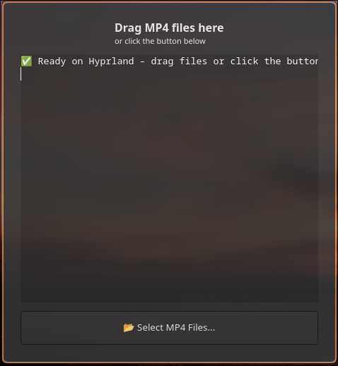

# resolve-drop

**One-click MP4 → MOV converter for DaVinci Resolve on Linux (especially Hyprland/Wayland)**

Drag MP4 files onto the window (or use the button) → instantly get perfect `.mov` files with PCM audio that Resolve can import with sound. Video is copied bit-for-bit (zero quality loss, super fast).

Created because Resolve Studio on Linux has **no AAC decoder** (patent licensing thing). Every phone/camera/OBS/web MP4 fails silently on audio. This fixes it permanently.

 <!-- replace with your screenshot when you upload the repo -->

## Features

- Native drag & drop (fully fixed for Hyprland, Dolphin, Thunar, etc.)
- Big reliable “Select MP4 Files…” button (always works)
- Live FFmpeg output in the window
- Skips files that already have a matching `.mov`
- Processes dozens of files at once
- Tiny binary (~200 KB), no Electron, no Python, pure C + GTK4
- Auto-scrolls the log
- Works on X11 and Wayland

## Requirements

- Arch Linux / any distro with:
  - `gtk4`
  - `ffmpeg`
- That's it. (The program is self-contained.)

## Build & Install (one-time)

```bash
git clone https://github.com/yourusername/resolve-drop.git
cd resolve-drop
gcc -Wall -O2 resolve-drop.c -o resolve-drop $(pkg-config --cflags --libs gtk4)
